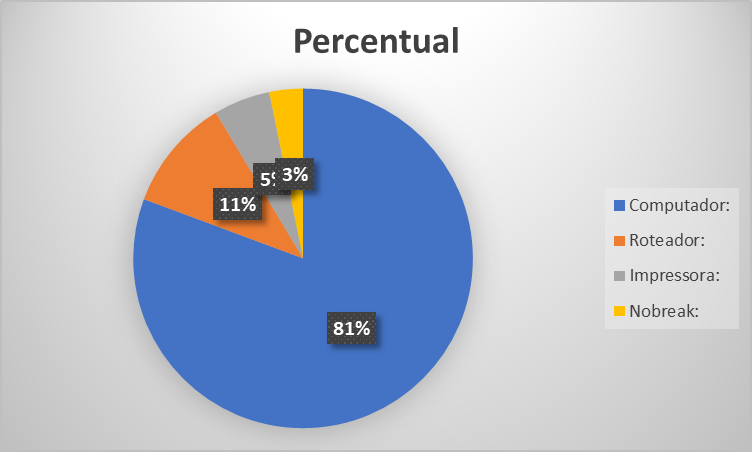
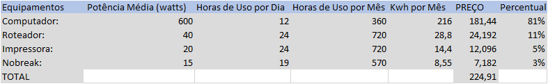

# Office-Básico

1. Imagem: Gráfico Pizza\

2. Imagem: Tabela Excel\

3. Documento: PowerPoint\
   [PowerPoint](3.pptx)

4. Documento: Word\
   [Word](5.docx)

5. Documento: Excel\
   [Excel](4.xlsx)

